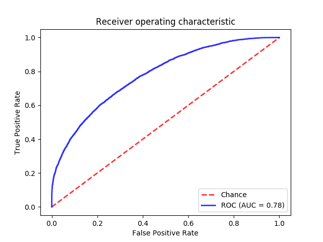

# Grab aiforsea.com challenge: Safety

Driving safety detection (binary classification) challenge by Grab https://www.aiforsea.com/safety

## Setup

> Tested on Ubuntu 18.04 LTS

Dependencies:

1. `python` 3.x
2. `gcc` 7.4.x (for building dependencies)
3. `python3-tk` (Optional. for displaying plot GUI)
4. Other libraries mentioned during dependencies installation error (may vary between OS)

Installation:

1. Install dependencies: `pip3 install -r requirements.txt` 
1. Download and extract [dataset](https://s3-ap-southeast-1.amazonaws.com/grab-aiforsea-dataset/safety.zip) to repository's root: `unzip safety.zip` (verify that following paths are valid: `./safety/features` and `./safety/labels`)

## Exploration

Exploration and experiments with notebook:

1. Run jupyter `jupyter notebook`
1. Open notebook from browser http://localhost:8888/notebooks/safety/safety.ipynb

## Usage

There is only one main script to do all process `safety/main.py`. For list of arguments and options, run `python main.py -h`

### Flow: train -> test (predict)

Train models using features CSVs inside `features/` subdirectory and label `labels/part-00000-e9445087-aa0a-433b-a7f6-7f4c19d78ad6-c000.csv`. Save output model in `model.joblib` (`-v` is used to display feature engineering progress bar): 

```
python main.py train --features_csv_dir "features/" --labels "labels/part-00000-e9445087-aa0a-433b-a7f6-7f4c19d78ad6-c000.csv" --model "model.joblib" -v
```

> **10m4,747s** using data from `safety.zip` on Ubuntu 18.04 LTS i7-5500U 8 GB RAM

Test (predict) model `model.joblib` against features CSVs inside `test_features/` subdirectory and label `test_labels/part-00000-e9445087-aa0a-433b-a7f6-7f4c19d78ad6-c000.csv`. Save prediction result in `prediction.csv`:

```
python main.py test --features_csv_dir "test_features/" --labels "test_labels/part-00000-e9445087-aa0a-433b-a7f6-7f4c19d78ad6-c000.csv" --model "model.joblib" --prediction_csv prediction.csv
```

> If `python3-tk` is available, ROC AUC plot will be displayed during `test`



### Flow: preprocess -> train -> test (predict)

Preprocess training features CSVs inside `features/` subdirectory and label `labels/part-00000-e9445087-aa0a-433b-a7f6-7f4c19d78ad6-c000.csv`, save output to `train_dataset.csv`:

```
python main.py preprocess --features_csv_dir "features/" --labels "labels/part-00000-e9445087-aa0a-433b-a7f6-7f4c19d78ad6-c000.csv" --dataset_csv "train_dataset.csv" -v
```

> **10m7,110s** using data from `safety.zip` on Ubuntu 18.04 LTS i7-5500U 8 GB RAM

Preprocess test features CSVs inside `test_features/` subdirectory and label `test_labels/part-00000-e9445087-aa0a-433b-a7f6-7f4c19d78ad6-c000.csv`, save output to `test_dataset.csv`:

```
python main.py preprocess --features_csv_dir "test_features/" --labels "test_labels/part-00000-e9445087-aa0a-433b-a7f6-7f4c19d78ad6-c000.csv" --dataset_csv "test_dataset.csv" -v
```

Train model using preprocessed dataset `train_dataset.csv` then save the result in `model.joblib`:

```
python main.py train --dataset_csv "train_dataset.csv" --model "model.joblib"
```

> **0m13,765s** using data from `safety.zip` on Ubuntu 18.04 LTS i7-5500U 8 GB RAM

Test (predict) model `model.joblib` against preprocessed dataset `test_dataset.csv` then save prediction result in `prediction.csv`:

```
python main.py test --dataset_csv "test_dataset.csv" --model "model.joblib" --prediction_csv prediction.csv
```
